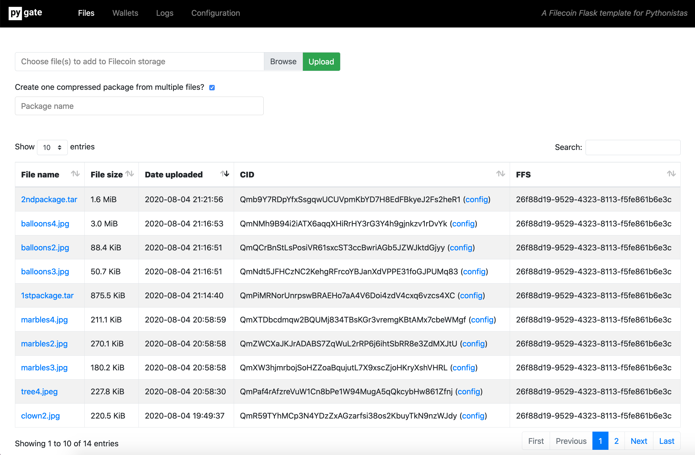

# pygate-webapp
A Filecoin Flask template application for Python developers using Textile.io's [Powergate](https://docs.textile.io/powergate/) and the [Pygate gRPC](https://github.com/pygate/pygate-gRPC) client.

# Features
* Upload a file or multiple files from your local machine to the Filecoin network.
* Download them from Filecoin back to your local machine.
* Check Wallet balances.
* Change Filecoin Filesystem (FFS) configuration settings and push them to files in storage.
* Review logs of your activities in the Pygate webapp.

# Quick installation
* `pip install pygate-webapp`
* check that the app installed properly:  
  `pygate-webapp --version`
* This is a development release of the pygate-webapp. It is designed to work with a Dockerized [Localnet Powergate](https://docs.textile.io/powergate/localnet/). It is assumed this is running concurrently at the `127.0.0.1:5002` address.
* Start the app and check `localhost:5000` in your browser:  
  `pygate-webapp`
* See `pygate-webapp -h` for setting options.
* You can change the Powergate server address (e.g. to a different Docker host address or an online hosted instance of Powergate that is connected to Testnet or Mainnet). Use by the -p flag on startup:  
  `pygate-webapp -p 123.123.123.123:5002`
# Developer installation
* Clone files and cd to directory:  
  `git clone https://github.com/pygate/pygate-webapp && cd pygate-webapp`  
* Set up virtualenv:  
  `virtualenv venv`  
* Activate virtualenv:  
  `source venv/bin/activate`  
* Install requirements:  
  `pip install -r requirements.txt`
* Create the application database:  
  `python create_db.py`
 * pygate-webapp is built using the [Python Flask](https://www.fullstackpython.com/flask.html) framework. To start the built-in development server:  
 `python run.py`
* Go to `localhost:5000` in your browser to use the app.
* This is a development release of the pygate-webapp. It is designed to work with a Dockerized [Localnet Powergate](https://docs.textile.io/powergate/localnet/). It is assumed this is running at the `127.0.0.1:5002` address. You can change the POWERGATE_ADDRESS in the `config.py` file.
* Help us improve this reference implementation. If you want to fix bugs, add new features, or improve existing ones, create a `dev/[feature-name]` branch and submit a Pull Request from it. Thanks!
